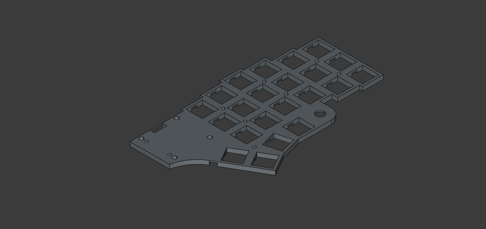
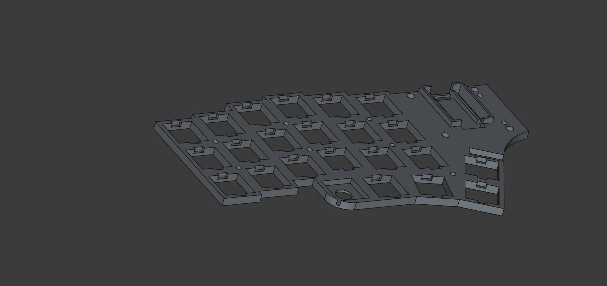
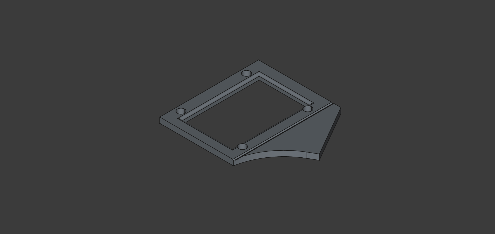
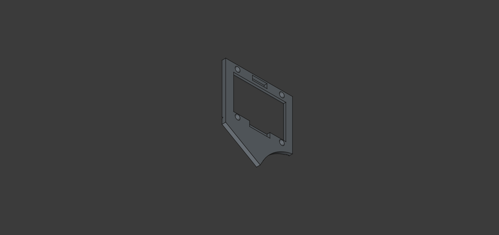

# erkbd - Eriks Keyboard

Erkbd is a 3D printed, handwired 44 key split keyboard powered by qmk.

It
features two encoders, two 1.3" 128x64 oled displays, and uses the
waveshare rp2040zero development board.

It is inspired primarily by [crkbd](https://github.com/foostan/crkbd) together
with the layout of the
[void ergo s](https://github.com/victorlucachi/void_ergo)

The keyboard was designed using [FreeCAD](https://www.freecad.org/) and printed
using a Creality Ender 3v3 ke 3D printer using creality CR PLA filament.

The name ERiks KeyBoarD is ment to honor corne (crkbd), which pulled me down
this money burning rabbit hole combined with the fact that my name is Erik.

## Images

The knife was a short but intense meme on reddit.com/r/ErgoMechKeyboards they
are not included.

## Issues and things to be aware of before building

If you decide to build this be aware that i am a hobbyist and amateur (as you
might tell from the image of the soldered plate). This was also my first 3D
modeling project with no previous CAD experience. It is not perfect and
there are a few issues listed here.

**Case dimensions**

For aesthic reasons I wanted the caps to be as close as possible to the case
edge, it took some trial and error before getting it right. Printing with another printer or using
other keycaps may cause the caps to hit the edge.

Before soldering, assemble the case and plate with switches and keycaps along
the border and make sure the keycaps stay clear of the case.

You might be able to just sand the edges a little but let me know if it doesnt
fit properly, and i will try to fix a new version with a larger gap.

**Controller mount**

The edges of the controller mount was too low in the first revision and i ended
up having to use more hot glue than i would have liked to secure them. I have
raised them a little and now the controllers should fit better and stay in place
with just friction but i have not tried this this out since i have no more
controllers.

**Switch holes**

The plate is 3mm thick but has pockets for the switches to click in. They fit
well enough for regular use but if you plan to change keycaps i recomend putting
some hot glue on each switch to secure them or be very careful when pulling the
caps to not damage the matrix

**Bumpers**

To keep the profile low and avoid the screws from hitting each other
in the middle of the spacers there are no pockets for the screws on the bottom
of the case. Without bumpons they will scratch your desk.

**Different OLED PCBs**

There are different pcb versions of the sh1106 OLED modules where the pin headers are
in slightly different places.

The frame is modeled for the right one in the picture. If you use left (which i did because i wanted white text) you will have to desolder the pin headers and
solder wire directly to the pcb from below. The firmware can stay the same.

If you dont want to desolder the headers make sure to get the one to the right
in the picture (blue text) then the headers will fit.

Also note that these they have ground and vcc pins reversed.

**Spacer positions**

The screws for two of the spacers holding the plate up are hidden behind the
oled modules. This makes it important to mount these first. Care should also be taken if removing the case so they don't fall out to avoid having to remove the oled
frame.

## BOM

**plate**
- ~18g x2 PLA Filament
- 46 pcs mx compatible switches and keycaps
- 2 pcs waveshare rp2040 zero development boards [link](https://www.amazon.com/RP2040-Zero-Pico-Like-Raspberry-Dual-Core-%EF%BC%8CMicroPython/dp/B0BZ8D7Y42/ref=sr_1_1?crid=2EZPO4N9PFMDS&dib=eyJ2IjoiMSJ9.dvAmtfoAQxvASlHhnkDMHjDo419lp5JBUB_KdeahPBENZ2jWRPrENE6BZwyak9NkNPHh-0WVS8arKABKc8e-opzixAtEBVskdnCF-sTaIDlp5_FSt0ZfaPsKxxYOLtvlk72SHUu-3rdMdK7WsvLEwGlhg300yzueWPkVqkfVxY1F5wBQ-IPZ9envqf_KLfkRUCyY9mZnsbTYmRF8wxTksuNam3qM5T2g8eYclrikdcE.ktlX3znEM6GyrlDSg6oMGNWvfkuf7PT6un18Lsm_SoY&dib_tag=se&keywords=waveshare%2Brp2040%2Bzero&qid=1741521086&sprefix=waveshare%2Brp2040%2Bzero%2Caps%2C149&sr=8-1&th=1)
- 2 pcs EC11 Rotary encoders [link](https://www.amazon.com/Encoder-Digital-Potentiometer-Compatible-Arduino/dp/B09KNC1J6H/ref=sr_1_3?crid=3VVT8OSKC7NCU&dib=eyJ2IjoiMSJ9.jPcxd6sUzMuEkDDF0LBehPbQWeiwCvjUtBKkyx9UvgGk2_fd6IlHg2P9BWC24rh6lpOtYqlDP_LAn2Dz4wtGbizYWfreiFmg51wngyeVbR-85pERG1JKV7q748bc3pzvGXSR7Si7bzC6LfTxc370QJf7rmuAo0LtxQbrZZ_X9GKjrIhA4_bC_iOOl78MOeuXOa0kMtmKLnhV09c8CvZiBRLLIAS813H4o-T_JQLihaE.Xq5dkHwbVuFNO_uTX5pwkn-zHkobnU-bV-ZrAg8hC6E&dib_tag=se&keywords=EC11+rotary+encoder&qid=1741521138&sprefix=ec11+rotary+encoder%2Caps%2C181&sr=8-3)
- 2 pcs DIP PJ320A trrs jacks [link](https://www.amazon.com/Female-Connector-Headphone-PJ-320A-Interface/dp/B093L8C4RN/ref=sr_1_1?crid=143PSLCHBDFI5&dib=eyJ2IjoiMSJ9.mEBb_SX8IQ9R8KDvnIn2jxiW0k1j6HlZVep6iWTq7xAJmFLLndOG1ZqUKy36Fh5CjM73RL4Bw7c89CDZuPTFqRi4g3qaemfEa8KWaDuoDMmFB3bBbnAapiJoTOqpWqtthNaJNXNmsdgloHh06u-Wdpb0D2UvUUSV6-2qxR1t1K3hB4RKHdGW1HzwWU_jLyiakSUP1znuy8Hi7xrIxHvHKcd8g7R_-eqwpIWSClsqu2JpLH9gHkMzpeUoK059WxXE2JTbK9I8P7F37KScXOyUuanjKntwDuHxD5Mb_u0F7fyv1CNLiqGocn93MmLqJeaYVuEIPd2Lir2wqPGjqHVXmvm__i7-9stFo5bMupE75rTyN8BweSGkcHxkCTh_gVFupE0aWAGcFMZHHTYdOr9v8JmM6XXSBBqgYtf1wmkaS_ajv53PDlSLst-rTaTyu6kV.KoWy8ZPv652--aXnq9T5Uvw70rJLdufV0BH4r55oUWQ&dib_tag=se&keywords=PJ320A&qid=1741521179&sprefix=pj320a%2Caps%2C226&sr=8-1)
- 44 pcs 1N4148 diodes (or similar) [link](https://www.amazon.com/BOJACK-Switching-IN4148-Electronic-Silicon/dp/B07Q4F3Y5W/ref=sr_1_1_sspa?crid=3MMZ7ML8I7CGW&dib=eyJ2IjoiMSJ9.th6lfaAmESxkKkYFSXmBtnT8dS5NwtA9s8sfqKmLwu3eBO_zPOu0Ya41mrhtpygxeluN1e3iT9AIG31O_zb1bJFnd62ko9kbROv37pHjwN_jcWFo97gj3JMKPYu8Xi5I1QbdG8CL1bwDgpC1WtVqcqkyThred8b1ixoINAkOGjDb6YckNC80MTeNzLpIA9w63rBuMvwVwxvcS7c2Du6ZUlCroud19O0hU6IRdDREcks.9WPV6-Eqy2ytX-RvJia_rUz3vMzoI-rqlJJ-hZotFDA&dib_tag=se&keywords=1N4148&qid=1741521218&sprefix=1n4148%2Caps%2C192&sr=8-1-spons&sp_csd=d2lkZ2V0TmFtZT1zcF9hdGY&psc=1)
- 1 pcs 4.7K resistor [link](https://www.amazon.com/EDGELEC-Resistor-Tolerance-Multiple-Resistance/dp/B07QJB3LGN/ref=sr_1_1_sspa?crid=2Z30BXILDBJTJ&dib=eyJ2IjoiMSJ9.DkICXAKHl8rdC0e3X2HFTyE_f9SXmt30bME1Y0yj7jq5-6dKzzkxrUTVKn96kzmcZIS5rK5s81i2wgJDYWNnW0hwawR-vvga3d7IDjDqfASh3AMLkfqvO64NYDM_ekE7KQgzNFQh7w2pdWIuPcuN2l7Bx4ysCtWqpXXftceB5JK06RVbNkmmYi00vNp8OYliMdSHqoIEj8MwsZBdMxYtNdCb-RVlKEB61dn__Wn0jy8.-aJX2f4sV9YV6z_Nhbnua9Yv1lGR19BhOiOCrPe2tBI&dib_tag=se&keywords=4.7k+ohm+resistor&qid=1741521248&sprefix=4.7k+ohm+resistor%2Caps%2C181&sr=8-1-spons&sp_csd=d2lkZ2V0TmFtZT1zcF9hdGY&psc=1)
- Wire for the matrix. I tried using 26 AWG solid core wire i had lying around for everything but
  found it to thick and ended up wiring the matrix separatly with solid core
  wire and connect to the controller with thin stranded wire i teared of a ribbon cable.

**Case**
- ~40g x2 PLA Filament
- 18 pcs 5mm M2 brass female/female spacers and 36 matching screws (18 is a little overkill so some could be skipped) [link](https://www.amazon.com/300pcs-Standoff-Column-Spacer-Assortment/dp/B07B9X1KY6/ref=sr_1_1_sspa?crid=FNRI9D2MPHMY&dib=eyJ2IjoiMSJ9.y_6OHFtGADLUPzid9qLjN36k5tp-CqbGHeGIimLP3i2R62ThJmQ1iJgXhqFSGinJeBZdz3SFb5sotDVXKgY3Dp24xXY3m5ebrqkvdkpZi706RMQIYB8bHJsu62uluYEnW-1uIN6ah7u3b4_4mk75GHBtLuD1QAh4ZV2fOxnffP01UHZdrOQLbaOYVAs20fvhqq0R1Sp3ctwRM31H6c0mYYWVaz6Q0eMG4vBtDXteQ1o.36RmGFCK1Bf6vSc2pew5PqODswY29PWJRDmMNXpdzCk&dib_tag=se&keywords=5mm+brass+standoff+bolt&qid=1741522139&sprefix=5mm+brass+standoff+bolt%2Caps%2C160&sr=8-1-spons&sp_csd=d2lkZ2V0TmFtZT1zcF9hdGY&psc=1)
- Silicone Bumpons [link](https://www.amazon.com/Cabinet-Bumpers-Adhesive-Cupboard-Cabinets/dp/B08BR6CGWL/ref=sr_1_2_sspa?crid=2R3FVT1FF83FP&dib=eyJ2IjoiMSJ9.HlCY5mroUOlPekD11gc8o0V-BGT64UObvsAT_tCslk8rr8NY-JUccNSfjtRveq6Ld9DIiQZfhHP--1pdl41yEkG-ar-JnpTY58S3Tzd5hOmR-73fCJaPU0OJS8zPANIgGzhLDYd5dqsyxbjQprrT6S7glZi-fg_IqdFHMRsR55gz9dKke7UcRpYVD9vOb-9aPSuQgyYawxX-KIKoP6TwMMtjsec4ManRRgxPpa6Gj1fbJUGqhQ3k7dR2CIy69-tYzJNch9xzVfuuWBLwCXLEU6PXyqj8vvAK3xM-B1uDY00.tJIeLNZYbpmH0gBsW9MHueg4j5IVlZ6XXtWHiRL6TPw&dib_tag=se&keywords=bumpons&qid=1741522202&sprefix=bumpons%2Caps%2C179&sr=8-2-spons&sp_csd=d2lkZ2V0TmFtZT1zcF9hdGY&th=1)

**Oleds**
- ~3g x2 PLA Filament
- 2 pcs  1.3" SH1107 oleds (see note on different versions above) [link](https://www.amazon.com/Hosyond-Display-Compatible-Arduino-Raspberry/dp/B0C3L54TL6/ref=sr_1_1_sspa?crid=1E2Q5AFOVJ46N&dib=eyJ2IjoiMSJ9.obgoDQ9yHfYtFiY5xLNx4KQh6IqXC4VcyjQzNN8s6BI20XoHeHhYGFtnvZBdLg5HDLJumZdt31puyvxlk51DwPTHwEGp5hujFxiYJ6mrDZfa35lWXcN-VbpzYSb_uBRbE6R233TTBkRtupMwQsHx5mJ4F0t8Xk0xBCWACsmgBNTff2R0lIxcUWgwsbynzmZdQ_HkR3Y9f4pFW64KEAmDChumJadVlBpzQMjz0yeVTH8.IvRBvRrQUqEvvOJIq6NE2Vpc2UFwE6VOTL_RU3DnH_Q&dib_tag=se&keywords=1.3%2Binch%2Boled%2Bsh11&qid=1741522245&sprefix=1.3%2Binch%2Boled%2Bsh11%2Caps%2C257&sr=8-1-spons&sp_csd=d2lkZ2V0TmFtZT1zcF9hdGY&th=1)
- 8 pcs M3*12mm bolts (for mounting the oleds) [link](https://www.amazon.com/Besitu-1600Pcs-Assortment-Washers-Printing/dp/B0D1KQCBMT/ref=sr_1_6?crid=FF8D9TQE12PD&dib=eyJ2IjoiMSJ9.ANdYAdt-eBS1_wBLEXTFREbpBsTE1o6_PSig-IMp5bO_1pEm8eb9Xfx_FO0jkI6yLpr7L1aqy4BVDbxBYGSbiThtGDW-1yMrAiPSH4v004fyRW-ih5iYIQaDZL4-0-lKpBnjxTlGuBKlTFsPOzh3yPlZO05uOl2BOvYaOwS6SCAF7aDhwZDmElZgAsP-y2EThyrv5E4pWGNeibNI8PgvDHnBlnJp7fizdNvRgcjpFaQ.KWUnckp9KzmS-oWd5Xicjg0m84zomdU3XFOxC11ljlM&dib_tag=se&keywords=m3%2B12%2Ballen%2Bhead%2Bkit&qid=1741522336&sprefix=m3%2B12%2Ballen%2Bhead%2Bki%2Caps%2C154&sr=8-6&th=1)
- 8 pcs M3*bolts

Regarding the m3 bolts you can use whichever you want as long as the
dimensions match but don't get ugly ones.

## Firmware

The keyboard source along with a default and debug keymap can be found in the official
qmk_firmware repo
[here](https://github.com/qmk/qmk_firmware/tree/master/keyboards/handwired/erikpeyronson/erkbd).

The prebuilt firmware in this repository is only intended for testing.

When creating your own keymap you can copy the keymaps/default directory for data driven keymap.json
configuration or keymaps/debug if you want to use a regular keymap.c

The only difference is that the debug version logs matrix events to the console and prints handedness instead of mod/layer status to the oleds.

## Build steps

#### Printing

The keyboard consists of 3 parts. The switch plate (printed face down), the case
(printed face up) and the oled frame (printed face down). In addition to this
you need to print 8 washers that sits between the oled pcb and plate to make the
components stay clear of the plate and align the top of the frame with the
bottom of the keycaps.

Since the oled frame and plate are printed upside down. The structure of your
print plate and z-offset calibration will have a big impact on the result

#### Flash the controllers.

Before starting, flash the controllers with the debug version of the firmware.
The default way to enter bootloader is to hold down boot and tap reset on the
board.

After flashing, bootloader can be entered by

- Double tapping reset on the controller
- Bootmagic (Holding down key 0, 0 (left side) or 4, 5 (right side) when powering
on
- Adding QK_BOOT to your keymap.

### Mount the switch plate and case.

Screw all the spacers to the switch plate and mount switches.

See [Issues](##Issues) for note about keycap clearance and access to spacers

#### Handedness pin. LEFT side only
To identify which half is left and which half is right a ~4.7K Pull up resistor
needs to be soldered between pin GP1 and 3.3V on the left half of the keyboard.

This is not a great position but wrapping the legs with electrical tape and
bending it behind the usb port works decently

#### Solder and mount the OLEDS

Solder wire to the oled modules (see the note in the first section about
different oled versions) make sure to note down which pin is which, you will not
be able to see the text on the pcb once the frame is mounted.

Feed the wire through the hole in the plate and and screw everything in place
using the M3 screws. The order from the top is

- Oled frame
- Oled module
- Printed washers
- Switch plate

Solder the the wires to the controllers.

| Oled pin | Controller pin |
| :------- | :------------- |
| VDD      | 3.3v           |
| GND      | GND            |
| SDA      | GP2            |
| SCL      | GP3            |

Remember to add the resistor.

Verify that the controler and oled works. When plugged right or left should be
printed on the oled depending on wich side is connected.

#### Wire the matrix
There are many handwiring guides around.
[this](https://github.com/qmk/qmk_firmware/blob/master/docs/hand_wire.md) is a
good starting place.

#### Pins
The matrix pins are different on the right and left side.

**Left side**

| Row | PIN |
| :-- | :-- |
| 0   | GP4 |
| 1   | GP5 |
| 2   | GP6 |
| 3   | GP7 |
|     |     |

| Column | PIN  |
| :----- | :--- |
| 0      | GP8  |
| 1      | GP9  |
| 2      | GP10 |
| 3      | GP11 |
| 4      | GP12 |
| 5      | GP13 |

**Right side**

| Row | PIN  |
| :-- | :--  |
| 0   | GP28 |
| 1   | GP27 |
| 2   | GP26 |
| 3   | GP15 |
|     |      |

| Column | PIN  |
| :----- | :--- |
| 0      | GP9  |
| 1      | GP10 |
| 2      | GP11 |
| 3      | GP12 |
| 4      | GP13 |
| 5      | GP14 |

**Encoders** When looked at from the bottom with the two pins pointing left and
three pins to the right the order follows the table.

| Pad    | Pin |
| :----- | :-- |
| A      | GP7 |
| GND    | GND |
| B      | GP8 |

The two pins on the other side are soldered to the matrix as a regular switch

**TRRS**

Push the trs jack into the slot on the plate with the three pins on one side
pointing out sideways on the top

The jack will be held in place by the case so hot glue is optional but
recommenced

| ttrs  | controller |
| :---- | :-- |
| 1 leg | GP0 |
| 1 leg | GND |
| 1 leg | 5v  |

Make sure you use the same legs on both halves. Double check with a multimeter before powering on.

#### Test, glue if needed, and assemble

Test everything before assembling the case, especially that you are able to
enter the bootloader using bootmagic on both sides. Check the qmk console
that all keys are properly registred.

Add hot glue where needed, in theory it should be possible to use no glue and
have everything fixed by friction but i recommend at least glueing the trs jack,
and controller. It makes mounting the case easier and will make it less fragile,
when inserting and the cable.

Then insert the plate in the case and secure with the m2 screws.

Happy hacking.