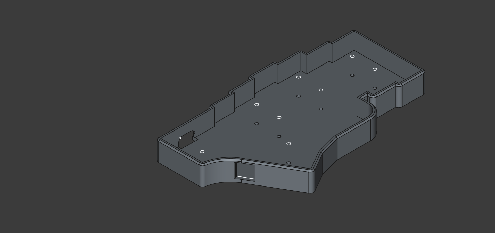

# Erkbd

Erkbd is a 3D printed handwired 44 key keyboard with two encoders and two 1.3" 128x64 oled displays, based on the rp2040-zero development board. It is inspired primarily by [Corne](https://github.com/foostan/crkbd) and [void ergo s](https://github.com/victorlucachi/void_ergo) keyboards

The keyboard was designed using [FreeCAD](https://www.freecad.org/) and printed using a Creality Ender 3v3 ke 3D printer

The name is ment to honor the amazing corne, which was my first step into this
hobby and my name is Erik. Hence ERiks KeyBoarD

## Images

## Issues and things to be aware of before building

If you decide to build this be aware that i am a hobbyist and amateur (as you
might tell from the image of the soldered plate). This was also my first 3D
modeling project with no previous CAD experience hence it is not perfect and
there are a few issues listed here

**Case dimensions**

For aesthic reasons I wanted the caps to be as close as possible to the case
edge, it took some trial and error before i got it right and the clearance
might be small enough for a differently calibrated printer or different keycaps
to cause problems. I do not know.

Before you start soldering, assemble the case and plate with switches and
keycaps along the border and make sure the keycaps are not hitting the case and
let me know if it doesnt fit properly, and i will try to fix a new version with
a larger gap

**Controller mount**

The edges of the controller mount was too low in the first revision and i ended
up having to use more hot glue than i would have liked to secure them. I have
raised them a little so the controllers should fit better and stay in place with
just friction but i have not tried this this out since i have no more controllers.

**Switch holes**

The plate is 3mm thick but has pockets for the switches to click in. They fit
well enough for regular use but if you plan to change keycaps i recomend putting
some hot glue on each switch to secure them or be very careful when pulling the
caps to not damage the matrix

**Bumpers**

To keep the profile low and avoid the screws from hitting each other
in the middle of the spacers there are no pockets for the screws on the bottom
of the case. Without bumpons they will scratch your desk.

**Different OLED PCBs**

There are different pcb versions of the sh1106 OLED modules where the pin headers are
in slightly different places. I had versions with both blue and white text. The
frame is modeled for the one with blue text. (Right in the picture below)

I decided to use the white ones but desolder the pin headers and solder wires
from below. A pocket for the headers that close to the edge could be seen when
assembled.

If you dont want to desolder the headers make sure to get the one to the right
in the picture (blue text)

Also note that these they have ground and vcc pins reversed.

**Spacer positions**

The screws for two of the spacers holding the plate up are hidden behind the
oled modules. This makes it important to mount these first. Care should also be
taken if removing the case to avoid these from loosening to avoid having to
remove the oled cover

## Support
I have kids and work full time and have limited ability to provide support
but if you have any issues let me know and i will try my best to help.

## BOM

**plate**
- ~18g x2 PLA Filament
- 46 pcs mx compatible switches and keycaps
- 2 pcs waveshare rp2040 zero development boards [link](https://www.amazon.com/RP2040-Zero-Pico-Like-Raspberry-Dual-Core-%EF%BC%8CMicroPython/dp/B0BZ8D7Y42/ref=sr_1_1?crid=2EZPO4N9PFMDS&dib=eyJ2IjoiMSJ9.dvAmtfoAQxvASlHhnkDMHjDo419lp5JBUB_KdeahPBENZ2jWRPrENE6BZwyak9NkNPHh-0WVS8arKABKc8e-opzixAtEBVskdnCF-sTaIDlp5_FSt0ZfaPsKxxYOLtvlk72SHUu-3rdMdK7WsvLEwGlhg300yzueWPkVqkfVxY1F5wBQ-IPZ9envqf_KLfkRUCyY9mZnsbTYmRF8wxTksuNam3qM5T2g8eYclrikdcE.ktlX3znEM6GyrlDSg6oMGNWvfkuf7PT6un18Lsm_SoY&dib_tag=se&keywords=waveshare%2Brp2040%2Bzero&qid=1741521086&sprefix=waveshare%2Brp2040%2Bzero%2Caps%2C149&sr=8-1&th=1)
- 2 pcs EC11 Rotary encoders [link](https://www.amazon.com/Encoder-Digital-Potentiometer-Compatible-Arduino/dp/B09KNC1J6H/ref=sr_1_3?crid=3VVT8OSKC7NCU&dib=eyJ2IjoiMSJ9.jPcxd6sUzMuEkDDF0LBehPbQWeiwCvjUtBKkyx9UvgGk2_fd6IlHg2P9BWC24rh6lpOtYqlDP_LAn2Dz4wtGbizYWfreiFmg51wngyeVbR-85pERG1JKV7q748bc3pzvGXSR7Si7bzC6LfTxc370QJf7rmuAo0LtxQbrZZ_X9GKjrIhA4_bC_iOOl78MOeuXOa0kMtmKLnhV09c8CvZiBRLLIAS813H4o-T_JQLihaE.Xq5dkHwbVuFNO_uTX5pwkn-zHkobnU-bV-ZrAg8hC6E&dib_tag=se&keywords=EC11+rotary+encoder&qid=1741521138&sprefix=ec11+rotary+encoder%2Caps%2C181&sr=8-3)
- 2 pcs DIP PJ320A trrs jacks [link](https://www.amazon.com/Female-Connector-Headphone-PJ-320A-Interface/dp/B093L8C4RN/ref=sr_1_1?crid=143PSLCHBDFI5&dib=eyJ2IjoiMSJ9.mEBb_SX8IQ9R8KDvnIn2jxiW0k1j6HlZVep6iWTq7xAJmFLLndOG1ZqUKy36Fh5CjM73RL4Bw7c89CDZuPTFqRi4g3qaemfEa8KWaDuoDMmFB3bBbnAapiJoTOqpWqtthNaJNXNmsdgloHh06u-Wdpb0D2UvUUSV6-2qxR1t1K3hB4RKHdGW1HzwWU_jLyiakSUP1znuy8Hi7xrIxHvHKcd8g7R_-eqwpIWSClsqu2JpLH9gHkMzpeUoK059WxXE2JTbK9I8P7F37KScXOyUuanjKntwDuHxD5Mb_u0F7fyv1CNLiqGocn93MmLqJeaYVuEIPd2Lir2wqPGjqHVXmvm__i7-9stFo5bMupE75rTyN8BweSGkcHxkCTh_gVFupE0aWAGcFMZHHTYdOr9v8JmM6XXSBBqgYtf1wmkaS_ajv53PDlSLst-rTaTyu6kV.KoWy8ZPv652--aXnq9T5Uvw70rJLdufV0BH4r55oUWQ&dib_tag=se&keywords=PJ320A&qid=1741521179&sprefix=pj320a%2Caps%2C226&sr=8-1)
- 48 pcs 1N4148 diodes [link](https://www.amazon.com/BOJACK-Switching-IN4148-Electronic-Silicon/dp/B07Q4F3Y5W/ref=sr_1_1_sspa?crid=3MMZ7ML8I7CGW&dib=eyJ2IjoiMSJ9.th6lfaAmESxkKkYFSXmBtnT8dS5NwtA9s8sfqKmLwu3eBO_zPOu0Ya41mrhtpygxeluN1e3iT9AIG31O_zb1bJFnd62ko9kbROv37pHjwN_jcWFo97gj3JMKPYu8Xi5I1QbdG8CL1bwDgpC1WtVqcqkyThred8b1ixoINAkOGjDb6YckNC80MTeNzLpIA9w63rBuMvwVwxvcS7c2Du6ZUlCroud19O0hU6IRdDREcks.9WPV6-Eqy2ytX-RvJia_rUz3vMzoI-rqlJJ-hZotFDA&dib_tag=se&keywords=1N4148&qid=1741521218&sprefix=1n4148%2Caps%2C192&sr=8-1-spons&sp_csd=d2lkZ2V0TmFtZT1zcF9hdGY&psc=1)
- 1 pcs 4.7K resistor (used for deciding handedness) [link](https://www.amazon.com/EDGELEC-Resistor-Tolerance-Multiple-Resistance/dp/B07QJB3LGN/ref=sr_1_1_sspa?crid=2Z30BXILDBJTJ&dib=eyJ2IjoiMSJ9.DkICXAKHl8rdC0e3X2HFTyE_f9SXmt30bME1Y0yj7jq5-6dKzzkxrUTVKn96kzmcZIS5rK5s81i2wgJDYWNnW0hwawR-vvga3d7IDjDqfASh3AMLkfqvO64NYDM_ekE7KQgzNFQh7w2pdWIuPcuN2l7Bx4ysCtWqpXXftceB5JK06RVbNkmmYi00vNp8OYliMdSHqoIEj8MwsZBdMxYtNdCb-RVlKEB61dn__Wn0jy8.-aJX2f4sV9YV6z_Nhbnua9Yv1lGR19BhOiOCrPe2tBI&dib_tag=se&keywords=4.7k+ohm+resistor&qid=1741521248&sprefix=4.7k+ohm+resistor%2Caps%2C181&sr=8-1-spons&sp_csd=d2lkZ2V0TmFtZT1zcF9hdGY&psc=1)
- Wire for the matrix. I tried using 26 AWG solid core wire i had lying around for everything but
  found it to thick and ended up wiring the matrix separatly with solid core
  wire and connect to the controller with very thin stranded wire.

**Case**
- ~40g x2 PLA Filament
- 18 pcs 5mm M2 brass female/female spacers and 36 matching screws (18 is a little overkill so some could be skipped) [link](https://www.amazon.com/300pcs-Standoff-Column-Spacer-Assortment/dp/B07B9X1KY6/ref=sr_1_1_sspa?crid=FNRI9D2MPHMY&dib=eyJ2IjoiMSJ9.y_6OHFtGADLUPzid9qLjN36k5tp-CqbGHeGIimLP3i2R62ThJmQ1iJgXhqFSGinJeBZdz3SFb5sotDVXKgY3Dp24xXY3m5ebrqkvdkpZi706RMQIYB8bHJsu62uluYEnW-1uIN6ah7u3b4_4mk75GHBtLuD1QAh4ZV2fOxnffP01UHZdrOQLbaOYVAs20fvhqq0R1Sp3ctwRM31H6c0mYYWVaz6Q0eMG4vBtDXteQ1o.36RmGFCK1Bf6vSc2pew5PqODswY29PWJRDmMNXpdzCk&dib_tag=se&keywords=5mm+brass+standoff+bolt&qid=1741522139&sprefix=5mm+brass+standoff+bolt%2Caps%2C160&sr=8-1-spons&sp_csd=d2lkZ2V0TmFtZT1zcF9hdGY&psc=1)
- Silicone Bumpons [link](https://www.amazon.com/Cabinet-Bumpers-Adhesive-Cupboard-Cabinets/dp/B08BR6CGWL/ref=sr_1_2_sspa?crid=2R3FVT1FF83FP&dib=eyJ2IjoiMSJ9.HlCY5mroUOlPekD11gc8o0V-BGT64UObvsAT_tCslk8rr8NY-JUccNSfjtRveq6Ld9DIiQZfhHP--1pdl41yEkG-ar-JnpTY58S3Tzd5hOmR-73fCJaPU0OJS8zPANIgGzhLDYd5dqsyxbjQprrT6S7glZi-fg_IqdFHMRsR55gz9dKke7UcRpYVD9vOb-9aPSuQgyYawxX-KIKoP6TwMMtjsec4ManRRgxPpa6Gj1fbJUGqhQ3k7dR2CIy69-tYzJNch9xzVfuuWBLwCXLEU6PXyqj8vvAK3xM-B1uDY00.tJIeLNZYbpmH0gBsW9MHueg4j5IVlZ6XXtWHiRL6TPw&dib_tag=se&keywords=bumpons&qid=1741522202&sprefix=bumpons%2Caps%2C179&sr=8-2-spons&sp_csd=d2lkZ2V0TmFtZT1zcF9hdGY&th=1)

**Oleds**
- ~3g x2 PLA Filament
- 2 pcs  1.3" SH1107 oleds (see note on different versions above if you do not want blue text) [link](https://www.amazon.com/Hosyond-Display-Compatible-Arduino-Raspberry/dp/B0C3L54TL6/ref=sr_1_1_sspa?crid=1E2Q5AFOVJ46N&dib=eyJ2IjoiMSJ9.obgoDQ9yHfYtFiY5xLNx4KQh6IqXC4VcyjQzNN8s6BI20XoHeHhYGFtnvZBdLg5HDLJumZdt31puyvxlk51DwPTHwEGp5hujFxiYJ6mrDZfa35lWXcN-VbpzYSb_uBRbE6R233TTBkRtupMwQsHx5mJ4F0t8Xk0xBCWACsmgBNTff2R0lIxcUWgwsbynzmZdQ_HkR3Y9f4pFW64KEAmDChumJadVlBpzQMjz0yeVTH8.IvRBvRrQUqEvvOJIq6NE2Vpc2UFwE6VOTL_RU3DnH_Q&dib_tag=se&keywords=1.3%2Binch%2Boled%2Bsh11&qid=1741522245&sprefix=1.3%2Binch%2Boled%2Bsh11%2Caps%2C257&sr=8-1-spons&sp_csd=d2lkZ2V0TmFtZT1zcF9hdGY&th=1)
- 8 pcs M3*12mm bolts (for mounting the oleds) [link](https://www.amazon.com/Besitu-1600Pcs-Assortment-Washers-Printing/dp/B0D1KQCBMT/ref=sr_1_6?crid=FF8D9TQE12PD&dib=eyJ2IjoiMSJ9.ANdYAdt-eBS1_wBLEXTFREbpBsTE1o6_PSig-IMp5bO_1pEm8eb9Xfx_FO0jkI6yLpr7L1aqy4BVDbxBYGSbiThtGDW-1yMrAiPSH4v004fyRW-ih5iYIQaDZL4-0-lKpBnjxTlGuBKlTFsPOzh3yPlZO05uOl2BOvYaOwS6SCAF7aDhwZDmElZgAsP-y2EThyrv5E4pWGNeibNI8PgvDHnBlnJp7fizdNvRgcjpFaQ.KWUnckp9KzmS-oWd5Xicjg0m84zomdU3XFOxC11ljlM&dib_tag=se&keywords=m3%2B12%2Ballen%2Bhead%2Bkit&qid=1741522336&sprefix=m3%2B12%2Ballen%2Bhead%2Bki%2Caps%2C154&sr=8-6&th=1)
- 8 pcs M3*bolts

Regarding the m3 bolts I got mine (black rounded allen head) from the kit in the
link but any would work. But since they are a very prominent part of the design don't get
ugly ones, brass would probably look pretty cool.

## Firmware

The configuration and a default keymap that can be used for debugging can be
found in my qmk fork
[here](https://github.com/erikpeyronson/qmk_firmware/tree/erkbd/keyboards/handwired/erikpeyronson/erkbd)
prebuilt firmware for the default keymap is available to download in this repo.

## Build steps

#### Printing

The keyboard consists of 3 parts. The switch plate (printed face down), the case
(printed face up) and the oled frame (printed face down). In addition to this
you need to print 8 washers that sits between the oled pcb and plate to make the
components stay clear of the plate and align the top of the frame with the
bottom of the keycaps.

I printed using an Ender 3 V3 ke using creality print slicer default settings
and Creality Black CR-PLA filament.

The Oled frame and switch plate are printed upside down. The structure of your
plate and z-offset calibration will have a big impact on the result

#### Flash the controllers.

Before starting, flash the controllers. The default way to enter bootloader is
to hold down the boot and tapping reset on the board.

After flashing , bootloader can be entered by double tapping the reset button.
Bootmagic (Holding down key 0, 0 when plugging in) or adding QK_BOOT
to your keymap.

Using QK_BOOT is the recommended way since you can access the reset button once
assembled and bootmagic erases EEPROM which has a limited number of read write
cycles

### Mount the switch plate and case.

Screw all the spacers to the switch plate and mount mount switches.

See [Issues](##Issues) for note about keycap clearance

#### Handedness pin. LEFT side only
To identify which half is left and which half is right a 4.7K Pull up resistor
needs to be soldered between pin GP1 and 3.3V on the left half of the keyboard.

This is optimal but i wrapped the legs in electrical tape and bent it behind the
usb port which worked. Since both the oled and resistor needs to be connected to
3v3 it is suitable to solder them both at the same time.

#### Solder and mount the OLEDS

Solder wire to the oled modules (see the note in the first section about oled
different oled versions) make sure to note down which pin is which, you will not
be able to see the text on the pcb once the frame is mounted.

Feed the wire through the hole in the plate and and screw it in place using the
M3 screws. The order from the top is

- Oled frame
- Oled module
- Printed washers
- Switch plate

Solder the the wires to the controllers.

| Oled pin | Controller pin |
| :------- | :------------- |
| VDD      | 3.3v           |
| GND      | GND            |
| SDA      | GP2            |
| SCL      | GP3            |

Remember the handedness resistor (left side only)

This is a good point to verify that the controller and oleds are working. when
connected The left half should print "left" and the right side "right".

#### Wire the matrix
There are many guides for handwiring around, and i am not experienced enough to
provide anything better. I based my technique on
[this](https://geekhack.org/index.php?topic=87689.0) but used the diode legs
instead of wires to create the rows. If you have never done it before i
encourage you to read multiple guides and select a technique you like.

#### Pins
The matrix pins are different on the right and left side.

**Left side**

| Row | PIN |
| :-- | :-- |
| 0   | GP4 |
| 1   | GP5 |
| 2   | GP6 |
| 3   | GP7 |
|     |     |

| Column | PIN  |
| :----- | :--- |
| 0      | GP8  |
| 1      | GP9  |
| 2      | GP10 |
| 3      | GP11 |
| 4      | GP12 |
| 5      | GP13 |

**Right side**

| Row | PIN  |
| :-- | :--  |
| 0   | GP28 |
| 1   | GP27 |
| 2   | GP26 |
| 3   | GP15 |
|     |      |

| Column | PIN  |
| :----- | :--- |
| 0      | GP9  |
| 1      | GP10 |
| 2      | GP12 |
| 3      | GP13 |
| 4      | GP12 |
| 5      | GP14 |

**Encoders** When looked at from the bottom with the two pins pointing left and
three pins to the right the order is

| Pad    | Pin |
| :----- | :-- |
| A      | GP7 |
| GND    | GND |
| B      | GP8 |

The two on the other side are soldered to the matrix as a regular switch

**TRRS**

| ttrs  | controller |
| :---- | :-- |
| 1 leg | GP0 |
| 1 leg | GND |
| 1 leg | 5v  |

Make sure you use the same legs on both halves. Double check with a multimeter before powering on.

#### Test, glue if needed, and assemble

Test everything before assembling the case, especially that you are able to
enter the bootloader. Make check the qmk console that all keys are properly
registred and that you are able to flash using bootmagic by holding down key 0:0
when connecting the usb.

Add hot glue where needed, it "should" be possible to use no glue and have
everything fixed by friction but i recommend at least glueing the trs jack, and controller it makes mounting the case easier and will make it less fragile, when inserting the cable.

Then insert the plate in the case and secure with the m2 screws.

Happy hacking.